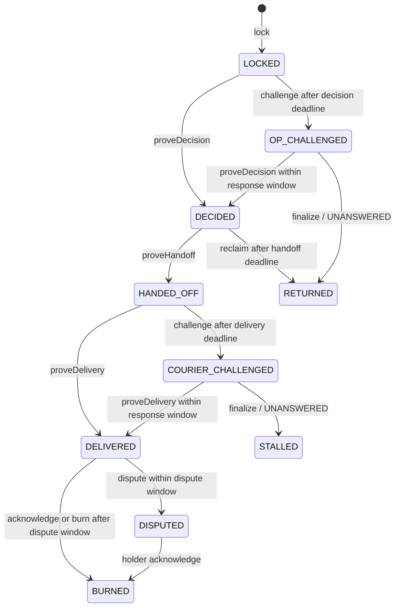
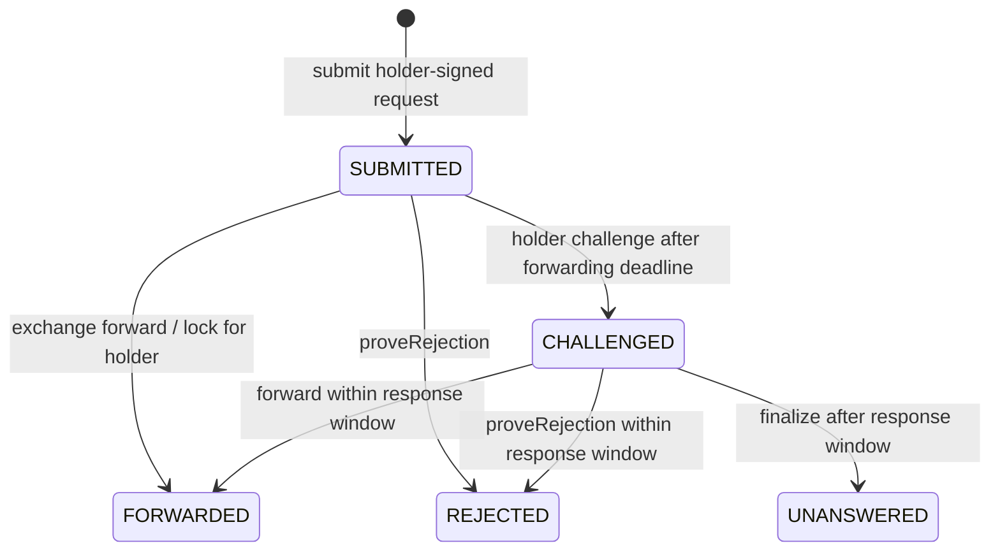

# BlockNotice

[한국어](README.md) | [English](README.en.md)

Gold RWA extension: [tnwjd023-boop/BlockNotice_GoldRWA](https://github.com/tnwjd023-boop/BlockNotice_GoldRWA).
Based on commit `39139b9` of the [original BlockNotice](https://github.com/kimsabin725/blocknotice), with its history preserved.

**In gold RWA redemption, the token lock is already onchain. Decisions, deadlines, and delivery claims remain offchain.**

Redemption request → token lock → operator decision → delivery provider → completion confirmation → burn.
Along this path, holders need to know **whose clock the process has stalled on**.
BlockNotice lets users verify decision records and deadlines using their own evidence and the public chain.
The processing promise is a promise to **record and provide evidence**, not a promise to approve redemption.

**Available now:** signed receipts, a public log, independent verifiers, **a redemption escrow and an exchange inbox**.
Locking tokens starts the operator's clock; handoff starts the delivery provider's clock.
Conditional returns, burns, and holder disputes run on a local chain, and public events reconstruct findings for each step.
`RedemptionInbox` tracks exchange forwarding, rejection, and non-response from a holder-signed request.
MockGold, the escrow, and the inbox are deployed on Sepolia and connected to the existing public log.
See the [public deployment record](docs/public-deployment.md) for addresses and verification results,
the [redemption specification](docs/redemption-design.md) for functions, deadlines, and design changes,
and the [submission status](docs/submission-status.md) for progress. These supporting documents are in Korean.

> This is a hackathon project (TRUST404, Track 3). The commands below reproduce the tests and scenarios.
> Gas figures were measured in the stated environment. Public-chain activity covers deployment and registration;
> the 30 scenarios run locally. These results do not establish production performance or customer adoption.

---

## 1. The problem — who uses this?

**Primary use case: redemption by high-value holders and institutions that can lock gold RWA tokens with their own keys.**
Even when the lock is onchain, the operator's approval or restriction decision, the handoff time,
and claims of physical delivery may remain inside institutional systems. Delays across three parties
can look like a single “redemption delay” to the holder.
This is the proposal's generalized redemption model, not a claim about any particular issuer's actual operations.

**Why gold RWA as the first scene.** For this structure to earn its keep, an asset has to meet six
conditions: (1) an institution exercises discretion between request and delivery, (2) several parties are
involved in sequence, (3) a processing deadline is stated, (4) delays actually occur, (5) the holder keeps
their own key, and (6) redemption is not rare. Physical gold redemption is strongest on (2): operator
decision, courier handoff, and delivery confirmation make three hops, so "whose clock stopped" separates
most clearly. We judge it weakest on (6): we assume most gold-token holding is not for physical redemption.
That is an assumption, not a measured figure. The trade-off is Limitation 16.

**The escrow contract does not know the asset class.** `RedemptionEscrow` accepts any burnable ERC-20
(`IBurnableERC20`); `MockGold` is a demo mock. Gold is the first scene chosen, not a premise of the
contract, and moving to another asset requires no contract rewrite.

| Audience | Scope |
|---|---|
| Self-custody holders and institutions | Primary users: lock directly in escrow to start the operator's clock |
| Issuers and operators | Potential adopters; the incentive to distinguish their responsibilities from those of exchanges and delivery providers is a hypothesis |
| Distribution exchanges | Receive signed requests through the inbox and fund locks for holders using their own tokens |
| Individuals holding tokens in an exchange wallet | Supported conditionally, if they can sign inbox requests with a key outside the exchange |
| Custodial users without a signing key | Outside the scope of direct use |

Passkeys and gas sponsorship are design ideas; the current demo uses secp256k1 wallets.

---

## 2. Run it

Node.js 22 and Foundry (`forge`, `anvil`) must be on PATH. The verified environment uses
Node 22.23.2, Foundry 1.8.3, and Solidity 0.8.28. Windows may also require the official Visual C++ x64 runtime.

```bash
git clone https://github.com/tnwjd023-boop/BlockNotice_GoldRWA.git
cd BlockNotice_GoldRWA
npm ci
forge install foundry-rs/forge-std@0d006dafa09d0b3722575acd29338b79c23e7c2f --no-git   # Once
forge build

npm run demo               # 30 scenarios (18 original + 12 redemption/inbox) + out/report.html
npm run scenarios          # Scenarios only; also writes out/scenarios.json
npm run test:all           # Solidity + TypeScript unit/integration tests (§8)
npm run typecheck          # TypeScript type checking
npm run check:deployment   # Check existing public log deployments; no .env needed
```

Generate and verify a receipt bundle from the original flow:

```bash
npm run issue -- --case screening    # Issue one synthetic rejection → out/bundle-screening.json
npm run verify -- out/bundle-screening.json          # File only; log inclusion is UNVERIFIABLE
```

**`npm run demo` checks the log, receipt, redemption escrow, and inbox scenarios and generates a report.**
Each scenario states **before execution** what an independent third party should conclude,
then runs against an actual local chain and compares the results.
Expectations name specific check IDs and statuses; a silent verifier cannot count as a pass.

`out/report.html` is a **single file that opens directly in a browser without a server**.
It contains actual execution results: scenario findings, original requester-held receipt bundles,
verifier JSON, public testnet addresses and links, and **measured institution-server access counts**.
The report distinguishes accelerated local demonstrations from public-chain evidence.

### Verify local evidence without the institution

```bash
# Start a fresh Anvil instance, run once, and keep the chain alive. Default port: 8611.
npm run scenarios -- --keep
# Use logContract from out/scenarios.json
npm run verify -- out/bundle-silent.json --rpc http://127.0.0.1:8611 --contract <LOG_ADDRESS>
# Use report.escrow / report.lockId from out/attack.courierSilent.json from that run
npm run verify -- --escrow <ESCROW_ADDRESS> --lock <LOCK_ID> --rpc http://127.0.0.1:8611
# Use report.inbox / report.requestId from out/attack.exchangeNotForwarded.json
npm run verify -- --inbox <INBOX_ADDRESS> --request <REQUEST_ID> --rpc http://127.0.0.1:8611
```

Replace `<...>` with values produced by that run. Stop the retained Anvil instance before running another demo.
For a forwarded inbox request, add `--include-escrow` to verify its linked lock too.
The original receipt verifier supports `--network sepolia` or `--network hoodi` for public-chain queries;
escrow and inbox queries require an explicit `--rpc`.

The original `verify <bundle.json>` path remains available. The redemption verifier pins queries to one block
and reconstructs state transitions from `Locked` onward alongside both institutions' `Appended` events.
Missing private plaintext does not invalidate an otherwise verifiable public record; only verification of
the private opening remains `UNVERIFIABLE`.
Exit code **0** means there are no `OBLIGATION_UNMET` checks, not that every check is confirmed;
the report may include `UNVERIFIABLE` or `OUT_OF_SCOPE`.
Exit code **1** indicates unmet checks; **2** indicates execution errors such as invalid arguments or RPC failures.

---

## 3. Threat model

| Actor | Capabilities | Possible attacks |
|---|---|---|
| **Institution (decision maker)** | Log signing key, anchor key, database, server, mempool observation | Omit, delete, alter, or backdate records; replace reasons after the fact; withhold receipts; extend its own deadlines; hide lateness with a late response |
| **Requester** | Own key and received receipts | Fabricate obligations, use another person's receipt to harass an institution, make false accusations with manipulated bundles |
| **Third-party attacker** | Own domain and keys | Present a wholly fabricated bundle as authentic |
| **External observer** | Access to logs, anchors, and public submissions | Attempt to identify private request contents and estimate volumes; in the escrow, holder addresses, amounts, burns, and returns are public |

**Outside the model's guarantees:** simultaneous compromise of the log and anchor keys, chain reorganizations,
the requester also being the decision maker, and **proof of offchain delivery itself** (which this system does not provide).

---

## 4. Guarantees and non-guarantees

### What the existing log and receipt flow verifies

1. **Record integrity** — whether a held receipt's signature matches its public commitment. Later substitution is detectable.
2. **Acceptance accountability** — whether the recording deadline in an institution-signed acceptance was met.
   Deadlines derive from **blocks observed by the chain**, not the institution's clock (§6).
3. **Independent submission** — whether requesters can leave a public record of their submission even without a receipt.
4. **Zero institution-server accesses** — `globalThis.fetch` calls are instrumented during verification.
   Escrow and inbox observers report public-RPC call windows separately from other calls.
   This demonstrates verification without the institution's server; it is not a network audit of every HTTP library or concurrent task.

### What the redemption escrow verifies

- It calculates the operator's decision-record deadline from the lock block and the delivery provider's record deadline from the handoff anchor.
- The `finalize` call that establishes operator non-response as `UNANSWERED` returns the tokens.
  The chain does not execute transactions on its own.
- A delivery claim in the delivery provider's own log, together with holder acknowledgement and the dispute window, governs burning.
- Decision outcomes and reasons are bound in a private digest. DENY and DEFER are not exposed as public states.

### What the exchange inbox verifies

- The exchange's forwarding deadline starts at the submission block of a holder's EIP-712 signed request.
- The registered exchange operator either funds a lock for the holder atomically or proves a rejection record in that exchange's log.
- If a challenge finalizes as `UNANSWERED` without forwarding or rejection, only the exchange step is marked unmet.
  The operator's clock never starts.
- It verifies the holder's signature, not an exchange customer relationship, account balance, or redemption eligibility.

### What it does not guarantee

1. **Truth of private reasons** — commitments detect replacement, not whether the content is true.
2. **Decisions never disclosed to anyone** — their existence cannot be discovered.
3. **Offchain delivery** — **no contract can prove that an offchain request was actually sent**.
   The original log's receipt-free `postNotice` is a **neutral record**.
   The separate `RedemptionInbox.submit` starts the exchange response procedure defined by the contract,
   but does not prove any earlier offchain delivery.
4. **Completeness** — each affected user detects omissions only for **their own entries** (the CONIKS model).
   Total omissions can only be approximated using anchor sizes and the union of receipts.
5. **Legal enforcement** — the chain does not create legal obligations; it records breaches of recorded commitments.
6. **Physical reserves** — this belongs to proof of reserves. The system does not verify that gold exists in a vault.
7. **Actual gold delivery or the merits of an eligibility decision** — a delivery log is the provider's claim.
   Absence of a holder dispute does not prove physical fulfillment.

**The current log challenge checks three things:** whether the anchor corresponding to the submitted proof exists,
whether the response was timely, and whether its inclusion proof is valid. It claims no more than that.

### Findings are not collapsed into pass/fail

| Status | Meaning |
|---|---|
| `CONFIRMED` | Confirmed by signatures, bindings, or inclusion proofs |
| `NOT_DUE` | The obligation's deadline has not arrived — **not a violation** |
| `OBLIGATION_UNMET` | A check mismatch, receipt deadline violation, or finalized onchain non-response; inspect the specific check |
| `UNVERIFIABLE` | Insufficient evidence to decide — **not a violation** |
| `OUT_OF_SCOPE` | A fact this tool does not guarantee |

Anchor status also distinguishes `SIGNED_PENDING_ANCHOR` (signed only) from `ANCHORED` (recorded in the public log).
The original receipt verifier also uses `OBLIGATION_UNMET` for signature or commitment mismatches.
A mismatch in a manipulated file does not, by itself, establish institutional wrongdoing or non-response.
An omission finding requires separate onchain `UNANSWERED` evidence.
The design separates missing evidence from confirmed mismatches; read each finding together with its check and supporting evidence.

---

## 5. State machines

### Implemented receipt-based challenge

```text
                        Requester signs R
                                |
                 +--------------+--------------+
                 v                             v
       Institution issues receipt          No receipt
       (signs recording deadline)              |
                 |                             v
                 |                         postNotice
                 |                       PUBLIC_NOTICE
                 |                    Neutral, not a violation
                 v
       Recorded by the deadline?
            /             \
          Yes              No
           |                |
       CONFIRMED     challengeAccepted  <- Only the requester named in the receipt
                            |              Deadline derived from the cited anchor
                           OPEN
                         /      \
                  respond        responseWindow expires; finalize
                     |                         |
                  ANSWERED                 UNANSWERED
                + late flag          Finalized onchain finding

       A late response cannot erase the fact that it was late.
```

### Redemption escrow: operator and delivery provider



The operator's clock starts at the **lock block**; the delivery provider's starts at the **handoff anchor block**.
The decision digest is `keccak256(abi.encode(outcome, category, reasonCommit, salt))`;
the chain does not see its plaintext. If the handoff deadline passes without a proven handoff, the holder can use `reclaim`.
Delivery records must be proven against the delivery provider service's roots.

`STALLED` keeps tokens locked after delivery-provider non-response; `DISPUTED` keeps them locked after a holder dispute.
Both require offchain resolution. There is no administrator path that lets the operator bypass conditions to complete or burn.
However, once the dispute window in `DELIVERED` expires, anyone, including the operator, can call `burn`.
Late anchoring remains visible through `late`. Handoff proofs are accepted only through the handoff deadline,
so they cannot race a reclaim after that deadline.
The dispute window starts at the block where the escrow accepts the delivery proof.
Submitting an old anchor later still gives the holder the full window.
See the [detailed specification](docs/redemption-design.md) (Korean) for boundary conditions added to the proposal.

### Exchange inbox: the clock before the lock



Before a challenge, forwarding or rejection can still be accepted after the initial deadline, with lateness recorded.
The operator's clock starts at the `lockId` recorded by `FORWARDED`.
An unrelated gift lock created by a third party does not fulfill the inbox request.

---

## 6. Public log contract (`contracts/src/BlockNoticeLog.sol`)

Business content is recorded as hashes, alongside metadata such as addresses, deadlines, tree sizes, and challenge states.
Request bodies, notice text, and private reason plaintext are not stored.
Roots are **calculated by the contract**, not accepted from the institution, preventing submission of a root unrelated to the stored tree.

| Function | Behavior |
|---|---|
| `registerService` | Register an institutional log; fix the deadline profile hash and **deadline intervals** |
| `appendBatch` | Append leaf hashes in order and recalculate the root; operator only |
| `postNotice` | A **neutral** public submission by a requester without a receipt; not an allegation of violation |
| `challengeAccepted` | Open an evidence challenge only after the deadline in an **institution-signed** acceptance receipt |
| `respond` | Respond only with an inclusion proof for a decision leaf **bound to this challenge's acceptance receipt**; another request's record or a REQ leaf cannot close it; late recording leaves a permanent `late` flag |
| `finalize` | Establish non-response within the deadline as onchain `UNANSWERED` |

`challengeAccepted` requires the institution's own signature, so **an obligation cannot be fabricated**.
`postNotice` lacks that signature and **does not count as a violation**.
This separation is central to the protocol.

### Two gaps found in review (2026-09-14)

A team review by [@tnwjd023-boop](https://github.com/tnwjd023-boop) found two gaps in the claim
that users could carry an evidence challenge through to completion. Both were fixed; earlier commits retain the old behavior.

1. **`respond` could close a challenge with any leaf.** A decision from another request, or even a requester's REQ leaf,
   could mark the challenge `ANSWERED` if it belonged to the same log.
   DEC leaves now use `H(0x00 ‖ H(2 ‖ acceptedDigest ‖ decisionDigest))`, embedding the **acceptance receipt digest**.
   `respond` takes the decision digest and computes the leaf using the acceptedDigest stored in the challenge.
   Another request's record fails with `BadInclusionProof` (`test_respondRejectsRecordOfAnotherRequest`,
   `attack.answerWithAnotherRecord`). The caller remains unrestricted: inclusion is a fact about the log,
   and a third party may prove that fact.
2. **The verifier declared an unmet obligation from a file alone.** Previously, an expired deadline and a missing decision
   in the bundle were enough, even though someone could strip that decision from the bundle.
   A file alone now yields `UNVERIFIABLE`; omission yields `OBLIGATION_UNMET` only when the chain's challenge is `UNANSWERED`.
   If the chain says `ANSWERED` but the bundle lacks the decision, that is an incomplete bundle or missing delivery,
   not a recording violation (`honest.strippedBundleIsNotAViolation`).

This binding establishes only that a decision record for this acceptance exists in the log.
The validity of its content and its delivery to the requester still require offchain verification and acknowledgement.

Two further safeguards apply.

**Deadlines derive from blocks observed by the chain, not the institution's clock.**
A receipt cites an observed anchor. The contract recalculates `anchor's actual block + registered interval`
and compares it with the receipt deadline. A mismatch yields `DeadlineNotDerived`; an unknown anchor yields `UnknownAnchor`.
**The institution cannot buy time by turning back its own clock.**

**A receipt copy is not authorization.**
Only the requester named in the receipt can open its challenge (`NotRequester`).
That field is part of the EIP-712 struct, so **the institution signs the requester binding**.
Seeing someone else's bundle does not authorize a challenge on their case.

### What happens if the institution withholds a receipt?

**In the original receipt flow, withholding an acceptance receipt prevents a signature-based challenge for that request.**
The user can pay gas to submit `postNotice`, but this does not force acceptance or a decision record.
The redemption escrow and inbox start separate contract-defined clocks through locking and signed-request submission, respectively.

---

## 7. What is new — the actual delta

A likely first question from judges is: **“How is this different from Arbitrum's delayed inbox?”**
This is **an adaptation of existing ideas**, not an invention of those primitives.

| Reference | Borrowed idea | Difference here |
|---|---|---|
| Arbitrum delayed inbox / zkSync priority queue / OP deposits | Soft confirmation, forced submission, inclusion deadlines | Rollups **enforce inclusion through their protocols**. Offchain decision services do not. This system checks inclusion against **Merkle anchors** instead of rollup state and uses receipt binding and chain-derived deadlines where protocol enforcement is unavailable |
| Certificate Transparency (RFC 6962/9162) | Append-only logs, inclusion proofs, monitoring one's own entries | CT gives issuers incentives to log. Here, **omission may be advantageous**, so requesters use their own receipts to establish non-recording through the challenge procedure |
| [SCITT (RFC 9943)](https://www.rfc-editor.org/rfc/rfc9943.html) | Signed statement → receipt structure | Conceptual reference only; **no wire-format compatibility is claimed** |

**Original protocol delta:** adapt forced-inclusion patterns to offchain decisions without protocol-level enforcement,
using **institution-signed deadlines** and **deadlines derived from chain-observed anchors**.

**Additional redemption delta:** when a request locks assets, **the clock starts without a receipt**.
The lock transaction removes the option of avoiding the clock merely by withholding a separate receipt;
handoff starts a separate delivery-provider clock. This does not enforce or establish the truth of physical fulfillment.

The original receipt flow's two-stage reason disclosure, taxonomy checks, and ACK are distinct from
the redemption extension's private outcome commitments.
The redemption extension does not publish ALLOW / DENY / DEFER or reason categories as plaintext onchain.

**No pre-hackathon code lives in this repository.** The first commit is 2026-09-13 and the build window
was 2026-09-07 to 09-20. Where the documents say "extended from `39139b9`", that points at an earlier
stage inside the same window: the receipt path was built first, then gold RWA redemption
(`RedemptionEscrow`, `RedemptionInbox`, inbox-linked verification, deployment cross-checks, and twelve
more scenarios) was built on top. The only external library is `forge-std`; the contracts, verifier, and
scenario harness were all written for this event.

---

## 8. Verification results and gas measurements

### Checks

| Type | Count | Coverage |
|---|---|---|
| Scenarios (`npm run scenarios`) | **30** | 20 attack + 10 honest scenarios; 18 original + 12 redemption/inbox; expected findings checked on local Anvil |
| Solidity unit tests | **107** | 32 original + 39 escrow + 36 inbox, including reference-tree fuzzing |
| TypeScript tests | **84** | Original flow, Windows execution, escrow/inbox evidence and real-chain integration, deployment tooling |

**All 20 attack scenarios matched their expected findings; zero mismatches across the 10 honest scenarios.**
An attack's expected result may be rejection, a lateness flag, `UNVERIFIABLE`, or `OUT_OF_SCOPE`;
not every attack is expected to produce a violation finding.
The harness's `falsePositives` field counts expectation mismatches in honest scenarios.
It is not a statistical measurement of a general detector's false-positive rate.
Coverage includes exchange inbox non-response. Results are written to `out/scenarios.json`;
redemption evidence is saved in files such as `out/attack.redeemSilent.json`.

### Existing log gas (Foundry measurements recorded by the original repository)

The extension does not change the log contract. These are the original measurements;
new escrow measurements follow in the next table.

| `appendBatch` batch size | 1 | 4 | 16 | 64 |
|---|---|---|---|---|
| Gas | 877,477 | 383,039 | 612,957 | 1,576,428 |

The one-leaf batch costs more than the four-leaf batch because the first call initializes storage slots.

| Function | Mean gas | Maximum |
|---|---|---|
| `registerService` | 201,580 | 207,251 |
| `challengeAccepted` | 104,714 | 141,656 |
| `respond` | 80,108 | 111,476 |
| `finalize` | 26,586 | 28,901 |
| `postNotice` | 38,881 | 58,750 |

Deployment bytecode size: 8,325 bytes.

### Escrow gas (measured 2026-09-17 with Foundry 1.8.3)

Results from `forge test --gas-report --match-contract RedemptionEscrowTest`.
Statistics include successful, reverting, and fuzz-test calls across the suite;
they are not fee estimates for a particular real-world transaction.

| Function | Mean gas | Maximum gas |
|---|---|---|
| `lock` | 216,660 | 225,259 |
| `lockFor` | 150,699 | 220,899 |
| `proveDecision` | 91,167 | 91,751 |
| `proveHandoff` | 92,833 | 94,564 |
| `proveDelivery` | 89,936 | 94,828 |
| `challenge` | 53,464 | 56,459 |
| `finalize` | 61,165 | 77,183 |
| `burn` | 51,968 | 74,629 |

At measurement time, escrow creation code was 12,617 bytes and deployment cost 2,415,277 gas.
Means may vary with fuzz seeds and the set of calls.

---

## 9. Public testnet deployments

### Gold RWA redemption — Sepolia (11155111)

| Contract | Address | Verification |
|---|---|---|
| MockGold | [0xb3a791fbb0a2f5001375dd32b6fb621837955b1a](https://sepolia.etherscan.io/address/0xb3a791fbb0a2f5001375dd32b6fb621837955b1a) | Sourcify `exact_match` |
| RedemptionEscrow | [0x8c8cbf50a91ce2c6d0746d0c4745d3a8b8f7778c](https://sepolia.etherscan.io/address/0x8c8cbf50a91ce2c6d0746d0c4745d3a8b8f7778c) | Sourcify `exact_match` |
| RedemptionInbox | [0x870238b0be5d5835ff47de3510875c996c01bb5d](https://sepolia.etherscan.io/address/0x870238b0be5d5835ff47de3510875c996c01bb5d) | Sourcify `exact_match` |

Six deployment and service-registration transactions completed on 2026-09-17.
Fixed escrow windows for decision/handoff/delivery/response/dispute are **20/40/60/30/30 blocks**;
inbox forwarding/response windows are **20/30 blocks**.
This does not mean physical redemption or the full scenario suite ran on the public network.
See [deployment and source-verification details](docs/public-deployment.md) (Korean) and the
[machine-readable record](escrow-deployments.json).

After installation and `forge build`, check the public deployment **without a wallet key**:

```bash
# Bash
SEPOLIA_RPC_URL=https://ethereum-sepolia-rpc.publicnode.com npm run check:escrow -- sepolia
```

```powershell
# PowerShell
$env:SEPOLIA_RPC_URL = 'https://ethereum-sepolia-rpc.publicnode.com'
npm.cmd run check:escrow -- sepolia
```

### Existing log deployments

| Network | Contract | Service registration transaction |
|---|---|---|
| **Sepolia** (11155111) | [`0xa4d46da2bc8bd6c113e254424be1e78002af5504`](https://sepolia.etherscan.io/address/0xa4d46da2bc8bd6c113e254424be1e78002af5504) | [`0x75e1cea4…63bf93b8`](https://sepolia.etherscan.io/tx/0x75e1cea4be1ca4954cff06eaeadd7f3b2c6a698e1fc1fd061de58d7c63bf93b8) |
| **Hoodi** (560048) | [`0x6841393c82c984edbc6eca822dab7028cc6f9a94`](https://hoodi.etherscan.io/address/0x6841393c82c984edbc6eca822dab7028cc6f9a94) | [`0x14fc2a2d…926a749e`](https://hoodi.etherscan.io/tx/0x14fc2a2d0ee3e5f0c9e662bc944fa1b860f187a6859c98dd9703ba20926a749e) |

Both use serviceId `demo-exchange`. The original repository records these as deployments of the
2026-09-14 `respond` fix; earlier addresses remain in git history.
`npm run check:deployment` checks code existence and registration details and prints runtime size.
It does not compare the deployed bytecode hash with the local build.
The original demo identifier `demo-exchange` is retained.
These addresses are log deployments, not redemption escrow deployments.

**The two chains have different profile hashes** because chainId and contract address are part of the hash.
Using a receipt from one chain on the other fails with `ProfileMismatch`. This separation is intentional.

### Check the records yourself

```bash
npm run check:deployment
```

For **every network** in `deployments.json`, this command rereads chainId, code existence,
service registration, institutional signer, and profile hash from public RPC endpoints.
Any mismatch produces a nonzero exit code. No `.env` is required.

### Deploy a new instance of the original log

Use `.env.example` as a reference to set a testnet `DEPLOYER_KEY` and the target RPC in `.env`.
If `.env` already exists, edit only the necessary entries to preserve its key.
These commands perform new deployments and update the corresponding network entry in `deployments.json`;
they are not read-only verification commands.

```bash
npm run deploy -- sepolia    # Deploy + register demo-exchange → network entry in deployments.json
npm run deploy -- hoodi      # Deploy the Hoodi log; update its network entry in deployments.json
```

`.env` is gitignored. Do not commit actual deployment private keys.
Local demo code uses publicly known Anvil development keys.

### Deploy and check the escrow and inbox

Start a local chain in a separate terminal, then deploy a new log, MockGold, escrow, and inbox:

```bash
anvil --port 8545
# In another terminal
npm run deploy:escrow -- local --record out/escrow-local.json
npm run check:escrow -- local --record out/escrow-local.json
```

Override the endpoint with `LOCAL_RPC_URL`. The default Anvil key is used only when `DEPLOYER_KEY` is absent,
and the tool first checks that the actual RPC chainId is 31337.
If `.env` contains another key, local deployment uses that key too, so its address needs a local-chain balance.
For public deployment, set `DEPLOYER_KEY` and `HOODI_RPC_URL` or `SEPOLIA_RPC_URL` in `.env`:

```bash
npm run deploy:escrow -- hoodi
npm run check:escrow -- hoodi
```

On public networks, the tool reuses the existing log in `deployments.json`.
New addresses, transactions, blocks, profiles, and runtime hashes go into the separate `escrow-deployments.json`,
without overwriting the original deployment file.
It refuses redeployment when a completed record exists or an interrupted submission has an ambiguous status.
Inspect the record and chain first, then select a new `--record` path if appropriate.

Without a wallet, the checker compares recorded code hashes, receipts, services, all immutable values,
and recalculated profiles. This command checks against the deployment record.
The three new Sepolia contracts have separately received Sourcify source verification;
neither check substitutes for an external security audit.
The deployment tool's three services have distinct IDs but are controlled by a single deployment wallet:
this is a **demo configuration**. Anyone can mint MockGold, and it is not backed by physical gold.
The new Sepolia deployment is recorded in [escrow-deployments.json](escrow-deployments.json).
Running the deployment command again against the existing Sepolia record is rejected.
For verification only, configure the RPC and run `npm run check:escrow -- sepolia`.
See [addresses, transactions, and source verification](docs/public-deployment.md) (Korean).

### Local demonstrations and public evidence are different

Scenarios that require **blocks to pass**, such as deadline expiry and finalized non-response,
use accelerated mining on local Anvil. The public testnet contains only activity that actually took place there.
Accelerated local results are not presented as events observed after waiting on a public network;
the demo materials distinguish them too.

### Why Sepolia, and why also Hoodi?

The [official Ethereum network documentation](https://ethereum.org/developers/docs/networks/),
checked on 2026-09-17, recommends Sepolia for application and contract development.
This redemption deployment uses Sepolia, while retaining the existing Hoodi log mirror.
Deadlines count blocks on the specific chain, not elapsed time, so migrating chains requires a new profile.

> The [Ethereum Foundation announcement dated 2025-03-18](https://blog.ethereum.org/2025/03/18/hoodi-holesky)
> listed 2026-09-30 as Sepolia's expected end-of-life date.
> The current [official network documentation](https://ethereum.org/developers/docs/networks/) describes
> Sepolia and Hoodi as maintained testnets, so this README does not present that shutdown as confirmed.
> Check the latest announcements before any further deployment.

Findings depend on block order and **can change under a reorganization of nearby blocks**.
The contracts cannot prevent this. Escrow and inbox verifiers pin their query block;
`--block` selects a historical block. The CLI currently has no `--min-confirmations` option.
Production use requires a separate finality policy.

---

## 10. Limitations

1. **The requester being the decision maker is not addressed.** If a party warns its own wallet,
   or the same legal entity controls both sides of the gate, this structure offers no protection.
2. **Record truth and legitimate key use are separate questions.** The log calculates each next root
   from its stored tree, preventing an operator from replacing past leaves.
   It cannot prevent a key holder from appending a new leaf containing a false claim.
3. **Increases in tree size per epoch reveal volume.** Outside observers can estimate how many records were processed.
4. **Institutional staking, penalties, and protocol fees are not implemented.** The escrow locks holder tokens
   and conditionally returns or burns them, but there is no separate institutional collateral penalizing non-response.
5. **Key rotation is not implemented.** Losing a holder key prevents holder-only actions such as challenge,
   reclaim, dispute, and acknowledgement. Public records remain available.
   The inbox supports EOA signatures only, not EIP-1271 smart-contract wallets.
6. **A holder whose redemption is blocked may be unable to pay gas.** Unconditional gas reimbursement from
   institutional deposits is a design idea, not an implementation.
   This may be less significant for the primary institutional use case but serious for individuals.
7. **Signed timelines cut both ways.** They can defend an honest institution and serve as evidence for a plaintiff.
   Legal teams may reject adoption; technology alone cannot resolve this.
8. **serviceId registration is first come, first served.** Receipts bind to the registered signer,
   preventing forgery of someone else's receipts merely by using their name, but names can be squatted.
   Using a domain hash as an ID does not prove ownership.
   Registration that verifies institutional identity or domain ownership is not implemented.
9. **Final redemption effects are not private.** Outcome codes and reason categories are private by design,
   but holder addresses, amounts, burns, and returns are public.
   A return alone does not distinguish DENY from delay, but retrospective inference remains possible.
10. **The chain does not resolve delivery-provider silence or false disputes.** `STALLED` and `DISPUTED`
    retain the lock. There is no forced dispute resolution or discretionary administrator release.
    A holder's `acknowledge` after a dispute permits burning.
11. **Physical instructions must follow a confirmed handoff.** Handoff proofs after the deadline are rejected,
    and the dispute window is guaranteed from proof acceptance.
    However, a selected root does not prove the first block in which a record was included.
    See [implemented design changes and remaining limitations](docs/redemption-design.md#설계-검토와-반영) (Korean).
12. **Issuer adoption incentives are a hypothesis.** These results do not validate customer adoption,
    real redemption operations, or legal enforcement.
13. **Only trusted burnable ERC-20 tokens are supported.** Fee-on-transfer behavior, rebasing, and false balance
    responses are outside scope. MockGold is a permissionless-mint demo token unrelated to physical gold.
    There is no administrator recovery or upgrade path.
14. **The inbox does not authenticate exchange customers or balances.** Anyone can sign a request to a registered service.
    Customer authentication, rate limits, and request collateral to address false balance claims or request flooding
    require separate implementation.
15. **The chain does not check whether a private decision approves redemption.** It verifies the decision digest
    and handoff inclusion proof, not whether the plaintext says ALLOW or the request is eligible for handoff.
16. **Gold is the better demo, not the first real-world choice.** Three hops make clock separation easy to
    show, but redemption itself is rare. Our candidate for meeting the six conditions of §1 more evenly is an asset
    **redeemed continuously with a documented processing deadline** (for example tokenised MMFs or
    short-term government bond products). Two hops make the picture less dramatic, but we judge (3), (4)
    and (6) to be stronger there. This is a judgement, not a measured market finding. Because the escrow
    is asset-neutral, moving requires no contract rewrite.
17. **The public deployment runs all three roles from one account.** In the Sepolia demo the operator,
    courier and exchange have distinct service IDs but share one operator/signer address,
    `0xD82DEbb00A73aC657eB9F56e2e2c861A29b0a7c6` (`commonControl: true` in `escrow-deployments.json`).
    This was for gas and operational convenience, and **this instance alone does not demonstrate that the
    three parties are actually separate.** Role separation is exercised in the local scenarios, where the
    operator, holder and courier are distinct accounts.

---

## 11. Architecture of the original receipt flow

```text
Requester -- signed request (EIP-712) + HPKE envelope --> Institution
          <-- AcceptedReceipt (recording deadline + requester binding, institution-signed)
                                                        REQ leaf recorded
          <-- DecisionRecord (encrypted delivery, institution-signed)
                                                        DEC leaf recorded
          -- optional ACK -->

Public log: ordered append-only Merkle tree, depth 32
Leaf: H(0x00 || H(type || digest))
DEC leaf: H(0x00 || H(2 || acceptedDigest || decisionDigest))
Verifier: five statuses from files + public log roots; zero institution accesses measured
```

- **Signatures:** EIP-712 / secp256k1. The domain contains name, version, chainId, and verifyingContract.
  serviceId is bound in signed structs and profiles, not in a domain field.
  The inbox likewise includes exchangeServiceId in the request struct.
- **Encryption:** HPKE (RFC 9180, DHKEM-X25519 + HKDF-SHA256 + AES-128-GCM).
  Signing keys and encryption keys serve different roles.
- **Private reasons:** only the `keccak256(abi.encode(detail, ruleIds, salt))` commitment goes into the receipt.
  Opening material is stored **per case**, with no global key.
- **Serialization:** bigint values use tagged objects. The earlier `"123n"` string format was not injective:
  a legitimate string containing `"123n"` could deserialize as BigInt and cause a false finding against an honest bundle.
  Tests cover this regression.
- **Policy:** `demo-policy-v1` is a public fixture. The verifier reruns the declared policy and inputs to check reproducibility.
  **The truth of the actual inputs is outside scope.**

---

## 12. Related work

The design draws on Certificate Transparency's append-only logs and inclusion proofs (RFC 6962/9162)
and the signed-statement-to-receipt structure of [SCITT (RFC 9943)](https://www.rfc-editor.org/rfc/rfc9943.html).
No wire-format compatibility is claimed.

BlockNotice provides a path for users to compare their own receipts with public commitments.
It complements institutional audit logs with independent verification on the user's side.

---

## 13. Demo and pitch deck

The five-minute submission script is in [`DEMO.md`](DEMO.md).
The current pitch deck is the [gold RWA redemption PDF](deck/BlockNotice_GoldRWA_pitch.pdf),
with its source in [`deck/pitch.html`](deck/pitch.html). The new PDF has 12 slides.
These presentation materials are in Korean.
The older [`deck/BlockNotice_pitch.pdf`](deck/BlockNotice_pitch.pdf) predates the redemption extension
and should not be used as the submission deck.
The script and HTML distinguish accelerated local scenarios from the actual Sepolia escrow and inbox deployments.

An English [consulting-style pitch deck](deck/BlockNotice_GoldRWA_pitch.en.pdf) is also available,
with [HTML slides](deck/pitch.en.html) and [editable source and Figma transfer status](deck/README.en.md).
It presents the same implementation with conclusion-led headlines and an updated evidence narrative.

---

## 14. Credits

Idea and committed by **SBK**. Review and feedback by [@tnwjd023-boop](https://github.com/tnwjd023-boop).

The original implementation was developed with Claude Code. Thanks to Claude and Anthropic.
The gold RWA escrow and inbox, verifiers, deployment tools, and submission-material extensions were developed with Codex.
AI was used to write contract, verifier, and scenario-harness code.
Design decisions, the threat model, and the selection of limitations above were made by people.

---

## 15. License

[Apache License 2.0](LICENSE), `Copyright 2026 kimsabin725`.

Apache-2.0 rather than MIT because of the **patent grant**. This ledger handles
promises that institutions sign, so the legal team reviewing adoption looks at patent
risk first. Apache-2.0 states that contributors grant a patent license along with the
copyright license, and terminates that grant for anyone who brings a patent suit. That
is the shape enterprise review expects.
