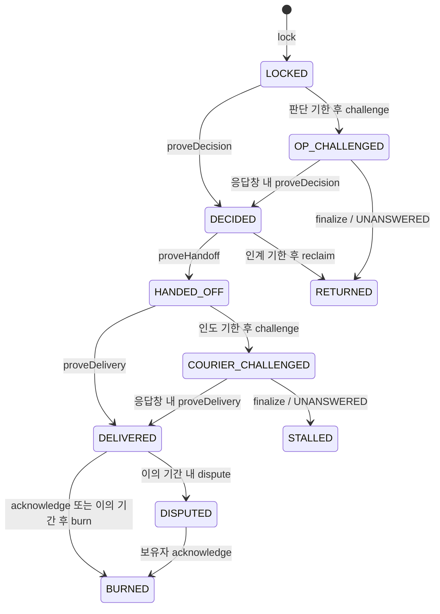

# BlockNotice

금 RWA 확장 저장소: [tnwjd023-boop/BlockNotice_GoldRWA](https://github.com/tnwjd023-boop/BlockNotice_GoldRWA).
[원본 BlockNotice](https://github.com/kimsabin725/blocknotice)의 `39139b9`에서 시작했으며 기존 이력을 유지합니다.

**금 RWA 상환에서 잠금은 이미 체인에 있고, 판단·기한·인도 주장은 체인 밖에 있습니다.**

상환 요청 → 토큰 잠금 → 운영사 판단 → 인도 기관 → 완료 확인 → 소각.
이 흐름에서 보유자가 알고 싶은 것은 **누구의 시계에서 처리가 멈췄는가**입니다.
BlockNotice는 판단 기록과 기한을 이용자가 자기 증거와 공개 체인으로 검증하게 합니다.
처리 약속은 상환을 승인하겠다는 약속이 아니라 **기록하고 증빙하겠다는 약속**입니다.

**현재 실행 가능:** 서명 영수증, 공개 로그, 독립 검증기, **상환 에스크로와 거래소 인박스**.
토큰 잠금으로 운영사 시계가, 인계로 인도 기관 시계가 시작됩니다. 조건부 반환·소각과 보유자 이의를
실제 로컬 체인에서 재현하고, 공개 이벤트로 홉별 판정을 다시 구성합니다.
`RedemptionInbox`는 보유자 서명 요청부터 거래소 전달·거절·무응답을 추적합니다.
기존 공개 로그에 연결한 MockGold·에스크로·인박스를 Sepolia에 배포했습니다.
주소와 검증 결과는 [공개 배포 기록](docs/public-deployment.md)에 있습니다.
구체적인 함수·기한·설계 보완 사항은 [상환 사양](docs/redemption-design.md), 작업 상태는
[제출본 현황](docs/submission-status.md)에 있습니다.

> 해커톤 프로젝트입니다(TRUST404 트랙 3). 아래의 모든 수치는 이 저장소에서 재현됩니다.
> 성능이나 고객 도입이 완료됐다는 보고가 아닙니다.

---

## 1. 문제 정의 — 누가 이걸 쓰는가

**1차 장면: 자기 키로 금 RWA 토큰을 잠글 수 있는 고액 보유자·기관의 상환 요청.**
잠금은 온체인이어도 운영사의 승인·제한 판단, 인도 기관에 넘긴 시점, 실물 인도 주장은 기관 내부에
남을 수 있습니다. 세 주체의 지연이 보유자에게는 하나의 「상환 지연」으로 보이는 문제를 다룹니다.
이는 특정 발행사의 실제 운영에 대한 주장이 아니라, 기획안의 일반화된 상환 구조입니다.

| 대상 | 범위 |
|---|---|
| 자기 지갑 보유자·기관 | 직접 에스크로에 잠가 운영사 시계를 시작하는 1차 대상 |
| 발행사·운영사 | 도입 주체. 거래소·인도 기관과 책임 구간을 구분할 유인이 있다는 가설 |
| 유통 거래소 | 서명 요청을 인박스로 접수하고 자기 토큰으로 보유자에게 대리 잠금 |
| 거래소 지갑에 둔 개인 | 거래소 밖 키로 인박스 요청에 서명할 수 있을 때만 조건부 |
| 서명할 키가 없는 커스터디얼 이용자 | 직접 이용 범위 밖 |

passkey·가스 대납은 설계 범위이며, 현재 데모는 secp256k1 지갑을 사용합니다.

---

## 2. 돌려보기

```bash
npm ci
forge install foundry-rs/forge-std@0d006dafa09d0b3722575acd29338b79c23e7c2f --no-git   # 최초 1회
forge build

npm run demo               # 30개 장면(기존 18 + 상환·인박스 12) + out/report.html ★
npm run scenarios          # 장면만 재현 (out/scenarios.json 도 함께 씀)
npm run test:all           # 단위 테스트 (최신 실측 수치는 §8)
npm run check:deployment   # 공개 테스트넷 배포를 체인에서 되읽어 대조 (.env 불필요)

npm run issue -- --case screening    # 합성 거절 1건 발행 → out/bundle-screening.json
npm run verify -- out/bundle-screening.json          # 파일만으로 — 로그 포함 여부는 UNVERIFIABLE

# 기관 없이 끝까지: 시나리오가 남긴 로컬 체인만 살려 두고, 파일 + 공개 RPC 로 검증
npm run scenarios -- --keep                          # anvil(:8611)과 로그 컨트랙트가 남습니다
npm run verify -- out/bundle-silent.json --rpc http://127.0.0.1:8611 --contract 0x5fbdb2315678afecb367f032d93f642f64180aa3
#   → 등록 정보·로그(이벤트로 재구성)·챌린지 판정을 체인에서 읽고, 기관 서버 접속 0회로 판정합니다
#   공개 테스트넷 영수증이면 --network sepolia|hoodi
```

**`npm run demo`가 로그·영수증과 상환 에스크로 시나리오를 검사하고 화면까지 냅니다.** 각 장면은
「독립된 제3자가 무엇을 결론지어야 하는가」를 **실행 전에** 명시하고, 실제 체인에서 돌린 뒤 대조합니다.
검증기가 조용해서 통과하는 일은 없습니다 — 기대값이 검사 항목 id와 그 상태를 직접 지목합니다.

`out/report.html`은 **서버 없이 브라우저로 바로 열리는 단일 파일**입니다. 색깔 애니메이션이 아니라
실제로 돌아간 결과를 싣습니다 — 장면별 판정, 요청자가 보유하는 영수증 묶음 원본, 검증기 출력 JSON,
공개 테스트넷 주소·링크, 그리고 **실측된 기관 접속 횟수**. 로컬 가속 시연과 공개 증거를
화면 안에서도 구분해 표시합니다.

### 에스크로 증거를 직접 검증하기

Node 22와 Foundry가 PATH에 있어야 합니다. Windows에서는 공식 Visual C++ x64 런타임도 필요할 수 있습니다.

```bash
npm run scenarios -- --keep
# 위 실행이 남긴 out/attack.courierSilent.json의 report.escrow / report.lockId 사용
npm run verify -- --escrow <ESCROW_ADDRESS> --lock <LOCK_ID> --rpc http://127.0.0.1:8611
# out/attack.exchangeNotForwarded.json의 report.inbox / report.requestId 사용
npm run verify -- --inbox <INBOX_ADDRESS> --request <REQUEST_ID> --rpc http://127.0.0.1:8611
```

기존 `verify <bundle.json>` 경로도 유지합니다. 상환 검증기는 하나의 블록에 조회를 고정하고
`Locked`부터의 상태 전이와 두 기관의 `Appended` 이벤트를 재구성합니다. 원문이 없어도 공개 기록 판정은 유지하며,
원문 개봉만 `UNVERIFIABLE`입니다. 무응답 확정이 있는 검증 명령은 의무 미이행을 보고하며 0이 아닌 종료 코드를 냅니다.

---

## 3. 위협 모델

| 행위자 | 가진 능력 | 시도할 수 있는 공격 |
|---|---|---|
| **기관(결정자)** | 로그 서명키, 앵커키, DB, 서버, 멤풀 관찰 | 기록 누락·삭제·수정·백데이트, 사유 사후 교체, 영수증 보류, 기한 자가 연장, 늦은 응답으로 지각 은폐 |
| **요청자** | 자기 키, 받은 영수증 | 없던 의무 날조, 남의 영수증으로 기관 괴롭히기, 조작된 묶음으로 허위 고발 |
| **제3자 공격자** | 자기 도메인·자기 키 | 통째로 위조한 묶음을 진짜처럼 제시 |
| **외부 관찰자** | 로그·앵커·공개 제출 열람 | 기존 비공개 요청 내용의 식별 시도, 건수 추정. 상환 에스크로에서는 보유자·수량·소각·반환이 공개됨 |

**비가정**: 로그키와 앵커키의 동시 유출, 체인 재구성, 요청자 = 결정자인 경우,
그리고 **오프체인 전달 자체의 증명**(존재하지 않습니다).

---

## 4. 보증하는 것 / 보증하지 않는 것

### 현재 로그·영수증 경로가 검증하는 것

1. **기록 무결성** — 보유한 영수증의 서명과 공개 커밋이 일치하는가. 사후 교체는 탐지됩니다.
2. **접수 책임** — 기관이 서명한 접수 약속의 기록 기한이 지켜졌는가.
   기한은 기관의 시계가 아니라 **체인이 본 블록**에서 나옵니다(§6).
3. **독립 제출** — 영수증을 못 받아도 요청자가 자기 제출 사실을 공개 경로에 남길 수 있는가.
4. **기관 서버 접속 0회** — 검증 중 나간 HTTP 호출 수를 **세어서** 보고합니다.
   상수 0이 아니라 실측값입니다. 어느 경로든 밖으로 손을 뻗으면 숫자가 올라갑니다.

### 상환 에스크로가 검증하는 것

- 잠금 블록부터 운영사의 판단 기록 기한, 인계 앵커부터 인도 기관의 기록 기한을 따로 계산합니다.
- 운영사 무응답을 `UNANSWERED`로 확정하는 `finalize` 호출에서 토큰을 반환합니다.
  체인이 스스로 트랜잭션을 실행하는 것은 아닙니다.
- 인도 기관 자신의 로그에 남긴 인도 주장과 보유자의 수령 확인·이의 기간을 소각 조건에 사용합니다.
- 판단 결과·사유는 비공개 다이제스트로 묶습니다. DENY·DEFER를 공개 상태로 만들지 않습니다.

### 보증하지 않습니다

1. **비공개 사유의 진실성** — 커밋은 교체를 탐지할 뿐, 내용이 참인지는 모릅니다.
2. **기관이 아무에게도 알리지 않은 판단** — 존재 자체를 발견하지 못합니다.
3. **오프체인 전달** — 요청자가 실제로 보냈는지는 **어떤 컨트랙트도 증명하지 못합니다.**
   영수증 없는 공개 제출은 위반이 아니라 **중립 기록**입니다.
4. **완전성** — 각 피결정자가 **자기 항목**에 대해서만 누락을 잡습니다(CONIKS 모델).
   전체 누락은 앵커 size와 영수증 합집합으로 근사할 뿐입니다.
5. **법적 강제력** — 체인은 의무를 만들지 않습니다. 약속 위반을 기록할 뿐입니다.
6. **실물 준비금의 존재** — PoR 영역입니다. 금이 금고에 있는지 검증하지 않습니다.
7. **실제 금 인도와 상환 적격성 판단의 타당성** — 인도 로그는 인도 주체의 주장입니다.
   보유자의 이의가 없었다고 물리적 이행을 증명한 것은 아닙니다.

**현재 로그 챌린지가 확인하는 것은 셋입니다**: ① 제출된 증명에 대응하는 앵커가 존재하는가
② 기한 안에 응답했는가 ③ 응답의 포함증명이 유효한가. 이 이상을 주장하지 않습니다.

### 판정은 통과/실패로 뭉치지 않습니다

| 상태 | 뜻 |
|---|---|
| 확인됨 `CONFIRMED` | 서명·바인딩·포함증명으로 확인됨 |
| 기한 미도래 `NOT_DUE` | 아직 의무 이행 기한 전 — **위반이 아님** |
| 의무 미이행 `OBLIGATION_UNMET` | 서명한 의무가 지켜지지 않음 |
| 검증 불가 `UNVERIFIABLE` | 자료가 없어 판단할 수 없음 — **위반이 아님** |
| 범위 밖 `OUT_OF_SCOPE` | 이 도구가 보증하지 않는 사실 |

앵커 상태도 `SIGNED_PENDING_ANCHOR`(서명만 받음)와 `ANCHORED`(공개 로그에 확정)로 나눕니다.
**「모르겠다」와 「위반이다」를 섞지 않는 것**이 이 도구가 오탐으로 무기가 되지 않는 이유입니다.

---

## 5. 상태 기계

### 현재 구현: 영수증 기반 챌린지

```
                      요청자 서명 R
                           │
              ┌────────────┴────────────┐
              ▼                         ▼
     기관이 접수 영수증 발행        영수증 없음
     (기록 기한에 서명)                 │
              │                         ▼
              │                   postNotice
              │                 ┌──────────────┐
              │                 │ PUBLIC_NOTICE│  중립. 위반 아님.
              │                 └──────────────┘
              ▼
       기한 내 기록?
        ┌─────┴─────┐
     예 │           │ 아니오
        ▼           ▼
   ┌─────────┐  challengeAccepted   ← 영수증이 지목한 요청자만
   │CONFIRMED│      │                 기한은 인용 앵커에서 역산
   └─────────┘      ▼
              ┌──── OPEN ────┐
      respond │              │ responseWindow 경과
              ▼              ▼
      ┌──────────────┐  ┌────────────┐
      │   ANSWERED   │  │ UNANSWERED │  온체인 확정 판정
      │ +late 플래그 │  └────────────┘
      └──────────────┘
       늦은 응답이 지각 사실을 지우지 못함
```

---

### 상환 에스크로: 운영사·인도 기관 두 홉



운영사 시계는 **잠금 블록**, 인도 기관 시계는 **인계 앵커 블록**에서 시작합니다.
판단 다이제스트는 `keccak256(abi.encode(outcome, category, reasonCommit, salt))`이며
체인은 그 원문을 보지 않습니다. 인계가 증명되지 않은 채 인계 기한을 넘기면 `reclaim` 경로를 사용합니다.
인도 기록은 인도 기관 서비스의 루트로만 증명합니다.

`STALLED`는 인도 기관 무응답 후 잠금 유지, `DISPUTED`는 보유자 이의 후 잠금 유지입니다.
두 경우 오프체인 해결이 필요하며 운영사 단독 완료·소각 경로는 없습니다.
앵커 지각은 `late`로 남습니다. 인계 증명은 인계 기한까지만 받으므로 기한 후 회수와 경쟁하지 않습니다.
이의 기간은 인도 증명이 에스크로에서 수락된 블록부터 시작합니다. 오래된 앵커를 늦게 제출해도 보유자에게
전체 기간이 주어집니다. 기획안에서 보완한 경계 조건은 [상세 사양](docs/redemption-design.md)에 명시했습니다.

---

## 6. 공개 로그 컨트랙트 (`contracts/src/BlockNoticeLog.sol`)

컨트랙트는 **해시만** 저장합니다. 요청 내용도, 통지문도, 비공개 사유도 모릅니다.
루트는 제출받지 않고 **컨트랙트가 직접 계산**합니다 — 기관이 자기가 만들지 않은 트리의 루트를 올릴 수 없습니다.

| 함수 | 하는 일 |
|---|---|
| `registerService` | 기관 로그 등록. 마감 프로필 해시와 **기한 간격**을 고정 |
| `appendBatch` | 리프 해시를 순서대로 추가, 루트 재계산 (운영자만) |
| `postNotice` | 영수증을 못 받은 요청자의 **중립** 공개 제출 — 위반 주장이 아님 |
| `challengeAccepted` | **기관이 서명한** 접수 영수증의 기한이 지났을 때만 증빙 요구 개시 |
| `respond` | **이 챌린지의 접수 영수증에 묶인** 결정 리프의 포함증명으로만 응답. 다른 건의 기록이나 REQ 리프로는 닫히지 않음. 늦게 기록된 경우 `late` 플래그가 영구히 남음 |
| `finalize` | 기한 내 무응답을 온체인 `UNANSWERED`로 확정 |

`challengeAccepted`는 기관 자신의 서명을 요구하므로 **없던 의무를 날조할 수 없고**, `postNotice`는
기관 서명이 없으므로 **위반으로 집계되지 않습니다**. 이 둘의 분리가 이 프로토콜의 핵심입니다.

### 검토에서 잡힌 구멍 두 개 (2026-09-14)

팀 검토([@tnwjd023-boop](https://github.com/tnwjd023-boop))에서 「이용자가 끝까지 진행하는 증빙 요구」라는
주장에 구멍 둘이 지적됐고, 둘 다 고쳤습니다. 이전 커밋에는 그대로 있습니다.

1. **`respond`가 아무 리프로나 닫혔습니다.** 같은 로그에 있는 리프면 다른 건의 결정이든 요청자의 REQ 리프든
   챌린지를 `ANSWERED`로 닫을 수 있었습니다. 이제 DEC 리프는 `H(0x00 ‖ H(2 ‖ acceptedDigest ‖ decisionDigest))`로
   **접수 영수증 다이제스트를 품고**, `respond`는 결정 다이제스트만 받아 챌린지에 저장된 acceptedDigest로
   리프를 직접 계산합니다. 다른 건의 기록은 `BadInclusionProof`입니다. (`test_respondRejectsRecordOfAnotherRequest`,
   `attack.answerWithAnotherRecord`) 호출자 제한은 두지 않았습니다 — 기관이 기록했다는 사실은 로그의 사실이지
   호출자의 사실이 아니고, 제3자가 대신 증명해 주는 건 문제가 아닙니다.
2. **검증기가 파일만 보고 「의무 미이행」을 냈습니다.** 번들에 결정이 없고 기한이 지나면 곧바로 위반으로
   찍었는데, 번들은 결정을 빼고 건네질 수 있습니다. 이제 파일만으로는 `UNVERIFIABLE`이고, 체인에서 읽은
   챌린지가 `UNANSWERED`일 때만 `OBLIGATION_UNMET`입니다. 체인이 `ANSWERED`인데 번들에 결정이 없으면
   「불완전한 번들 또는 전달 누락」이지 기록 위반이 아닙니다. (`honest.strippedBundleIsNotAViolation`)

이 연결이 보증하는 건 「이 접수에 대한 결정 기록이 로그에 있다」까지입니다. 결정 내용이 옳다는 것,
요청자에게 전달됐다는 것은 여전히 오프체인 검증기와 ACK의 몫입니다.

여기에 두 가지를 더 막습니다.

**기한은 기관의 시계가 아니라 체인이 본 블록에서 나옵니다.**
영수증은 자기가 관측한 앵커를 인용하고, 컨트랙트는 `그 앵커가 실제로 올라간 블록 + 등록된 간격`을
다시 계산해 영수증의 기한과 대조합니다. 어긋나면 `DeadlineNotDerived`, 없는 앵커를 인용하면
`UnknownAnchor`입니다. **기관이 자기 시계를 뒤로 돌려 시간을 벌 수 없습니다.**

**영수증 사본은 자격이 아닙니다.**
영수증에 이름이 적힌 요청자만 챌린지를 열 수 있습니다(`NotRequester`). 그 필드는 EIP-712 구조체
안에 있어서 **기관이 그 바인딩에 서명**합니다. 번들을 한 번 본 사람이 남의 사건으로 기관을 두드릴 수 없습니다.

### 남용이 어디로 퇴화하는가

**영수증 보류는 로그 완전성을 해치지 못하고 수수료 세금으로 퇴화합니다.**
매 에폭 성실히 앵커하면서 영수증만 안 주는 기관에게는 `UNANSWERED` 0건이 나옵니다. 대신 이용자는
자기 순번을 알기 위해 공개 제출 가스를 내야 하고, 그 비용이 곧 세금입니다. 이 구조는 그걸
막지 못하며, 막는 척하지도 않습니다.

---

## 7. 무엇이 새로운가 — 정직한 델타

심사위원의 첫 질문은 이것일 겁니다: **「Arbitrum의 delayed inbox와 뭐가 다르죠?」**
먼저 답하겠습니다. **발명이 아니라 이식입니다.**

| 참고한 것 | 거기서 가져온 것 | 여기서 달라진 것 |
|---|---|---|
| Arbitrum delayed inbox / zkSync priority queue / OP deposits | 소프트 확인 + 강제 제출 + 포함 기한 | 롤업은 **프로토콜이 포함을 강제**합니다. 오프체인 결정 서비스에는 그런 강제가 없습니다. 그래서 포함 여부를 롤업 상태 대신 **머클 앵커**로 판정하고, 강제가 없는 자리를 영수증 바인딩과 기한 역산으로 메웠습니다 |
| Certificate Transparency (RFC 6962/9162) | append-only 로그, 포함증명, 자기 항목 감시 | CT는 발급자가 로그에 올릴 유인이 있습니다. 여기선 **올리지 않는 것이 이득**이라, 안 올린 사실을 요청자가 자기 영수증으로 증명하게 만들었습니다 |
| SCITT (RFC 9943) | 서명 진술 → 영수증 구조 | 와이어 포맷 호환을 **주장하지 않습니다**. 개념만 참고했습니다 |

**기존 기술 델타**: 롤업의 강제 포함 패턴을, 프로토콜 강제가 없는 오프체인 결정에 옮기고,
그 빈자리를 **「기관이 서명한 기한」 + 「체인이 본 앵커에서의 역산」**으로 채운 것.

**상환 확장의 추가 델타**: 요청이 자산 잠금을 동반하면 **영수증 없이 시계가 시작됩니다.**
별도 영수증을 주지 않아 시계 시작을 피하는 경로를 잠금 트랜잭션으로 닫고, 인계부터는 인도 기관 시계를 분리합니다.
실물 이행의 강제나 진실성 증명까지 확장되는 것은 아닙니다.

기존 영수증 경로의 2단 사유 공개·분류표 판정·ACK와 상환 확장의 결과 비공개 커밋은 구분합니다.
상환 확장에서는 ALLOW / DENY / DEFER와 사유 분류를 체인에 평문으로 공개하지 않습니다.

---

## 8. 수치 — 전부 이 저장소에서 재현됩니다

### 검사

| 종류 | 개수 | 무엇을 보는가 |
|---|---|---|
| 시나리오 (`npm run scenarios`) | **30** | 공격 20 + 정직 10. 기존 18 + 상환·인박스 12, 실제 체인에서 기대 판정 대조 |
| Solidity 단위 테스트 | **107** | 기존 32 + 에스크로 39 + 인박스 36. 레퍼런스 트리 퍼즈 포함 |
| TypeScript 테스트 | **84** | 기존 경로, Windows 실행, 에스크로·인박스 증거·실제 체인 통합, 배포 도구 |

**공격 20개 전부 기대 판정 일치, 정직한 장면 10개 중 오탐 0건.**
각 공격의 성공 기준에는 거부·지각 표시·검증 불가·범위 밖도 포함됩니다. 전부 위반 판정이라는 뜻은 아닙니다.
인박스 무응답 시나리오를 포함합니다. 실행 결과는 `out/scenarios.json`, 상환별 공개 증거는 `out/attack.redeemSilent.json` 등으로 저장합니다.

### 기존 로그 가스 (원본 저장소의 Foundry 실측 기록)

이번 확장에서는 로그 컨트랙트를 변경하지 않았습니다. 아래는 원본 측정값이며 신규 에스크로 측정은 다음 표에 있습니다.

| `appendBatch` 배치 크기 | 1 | 4 | 16 | 64 |
|---|---|---|---|---|
| gas | 877,477 | 383,039 | 612,957 | 1,576,428 |

리프 1장이 4장보다 비싼 건 첫 호출이 스토리지 슬롯을 처음 채우기 때문입니다.

| 함수 | 평균 gas | 최대 |
|---|---|---|
| `registerService` | 201,580 | 207,251 |
| `challengeAccepted` | 104,714 | 141,656 |
| `respond` | 80,108 | 111,476 |
| `finalize` | 26,586 | 28,901 |
| `postNotice` | 38,881 | 58,750 |

배포 크기 8,325바이트.

### 에스크로 가스 (2026-09-17 Foundry 1.8.3 실측)

`forge test --gas-report --match-contract RedemptionEscrowTest` 결과입니다.
전체 테스트의 성공·거부·퍼즈 호출을 포함한 통계로, 특정 실사용 트랜잭션의 수수료 예측이 아닙니다.

| 함수 | 평균 gas | 최대 gas |
|---|---|---|
| `lock` | 216,660 | 225,259 |
| `lockFor` | 150,699 | 220,899 |
| `proveDecision` | 91,167 | 91,751 |
| `proveHandoff` | 92,833 | 94,564 |
| `proveDelivery` | 89,936 | 94,828 |
| `challenge` | 53,464 | 56,459 |
| `finalize` | 61,165 | 77,183 |
| `burn` | 51,968 | 74,629 |

측정 당시 에스크로 생성 코드 12,617바이트, 배포 비용 2,415,277 gas. 퍼즈 시드·호출 집합에 따라 평균은 달라질 수 있습니다.

---

## 9. 배포 (공개 테스트넷)

| 네트워크 | 컨트랙트 | 서비스 등록 tx |
|---|---|---|
| **Sepolia** (11155111) | [`0xa4d46da2bc8bd6c113e254424be1e78002af5504`](https://sepolia.etherscan.io/address/0xa4d46da2bc8bd6c113e254424be1e78002af5504) | [`0x75e1cea4…63bf93b8`](https://sepolia.etherscan.io/tx/0x75e1cea4be1ca4954cff06eaeadd7f3b2c6a698e1fc1fd061de58d7c63bf93b8) |
| **Hoodi** (560048) | [`0x6841393c82c984edbc6eca822dab7028cc6f9a94`](https://hoodi.etherscan.io/address/0x6841393c82c984edbc6eca822dab7028cc6f9a94) | [`0x14fc2a2d…926a749e`](https://hoodi.etherscan.io/tx/0x14fc2a2d0ee3e5f0c9e662bc944fa1b860f187a6859c98dd9703ba20926a749e) |

serviceId는 양쪽 모두 `demo-exchange`입니다. 원본 저장소에는 2026-09-14 `respond` 수정판의 배포로 기록돼 있고, 이전 주소는 git 이력에 있습니다.
`npm run check:deployment`는 코드 존재 여부와 등록 정보를 확인하고 런타임 크기를 출력합니다.
로컬 빌드와 배포 바이트코드의 해시 일치까지 검증하지는 않습니다.
`demo-exchange`는 초기 데모 식별자이며 이름을 유지합니다. 이 주소들은 기존 로그 배포이며 상환 에스크로 배포가 아닙니다.

**두 체인의 프로필 해시는 서로 다릅니다** — 해시에 chainId와 컨트랙트 주소가 들어가기 때문입니다.
한쪽 영수증을 다른 쪽에 들고 가면 `ProfileMismatch`로 떨어집니다. 의도된 격리입니다.

### 우리 말을 믿지 말고 직접 확인하세요

```bash
npm run check:deployment
```

`deployments.json`에 적힌 **모든 네트워크**에 대해 chainId·코드 존재·서비스 등록 여부·
기관 서명자·프로필 해시를 공개 RPC에서 다시 읽어 대조하고, 하나라도 어긋나면 0이 아닌 코드로 종료합니다.
`.env` 없이 동작합니다.

### 직접 배포하려면

```bash
cp .env.example .env         # DEPLOYER_KEY 채우기 (테스트넷 전용 지갑을 쓰세요)
npm run deploy -- sepolia    # 배포 + demo-exchange 등록 → deployments.json 에 네트워크별로 기록
npm run deploy -- hoodi      # Hoodi 로그 배포. deployments.json의 해당 네트워크 기록 갱신
```

`.env`는 gitignore 대상입니다. 실제 배포 개인키를 커밋하지 않습니다. 로컬 데모 코드는 공개된 Anvil 개발 키를 사용합니다.

### 에스크로·인박스 배포와 대조

로컬 체인을 별도 터미널에서 실행한 뒤 새 로그·MockGold·에스크로·인박스를 배포합니다.

```bash
anvil --port 8545
# 다른 터미널
npm run deploy:escrow -- local --record out/escrow-local.json
npm run check:escrow -- local --record out/escrow-local.json
```

`LOCAL_RPC_URL`로 주소를 바꿀 수 있습니다. 로컬 기본 키는 실제 RPC chainId가 31337일 때만 선택합니다.
공개 배포는 `.env`의 `DEPLOYER_KEY`와 `HOODI_RPC_URL` 또는 `SEPOLIA_RPC_URL`을 채우고 실행합니다.

```bash
npm run deploy:escrow -- hoodi
npm run check:escrow -- hoodi
```

공개망에서는 `deployments.json`의 기존 로그를 재사용합니다. 새 주소·트랜잭션·블록·프로필·런타임 해시는
별도 `escrow-deployments.json`에 기록하며 기존 배포 파일을 덮어쓰지 않습니다. 완료 기록이 있거나
중단된 전송 상태가 모호하면 재배포를 거부합니다. 먼저 기록과 체인을 조사한 뒤 새 `--record` 경로를 선택합니다.

검사기는 지갑 없이 기록된 코드 해시·영수증·서비스·모든 불변 값과 재계산한 프로필을 대조합니다.
배포 당시 기록한 런타임과의 비교이며 외부 보안 감사나 재현 빌드 인증은 아닙니다.
배포 도구의 세 서비스는 서로 다른 ID이지만 한 배포 지갑이 통제하는 **데모 구성**입니다.
MockGold는 누구나 발행할 수 있고 실물 금을 담보하지 않습니다.
Sepolia 신규 배포는 [escrow-deployments.json](escrow-deployments.json)에 기록했습니다.
현재 기록이 있는 Sepolia에 같은 명령으로 재배포하면 거부됩니다. 검증만 하려면 RPC를 설정하고
`npm run check:escrow -- sepolia`를 실행합니다. [주소·트랜잭션·소스 검증](docs/public-deployment.md)을 참조하세요.

### 로컬 시연과 공개 증거는 다릅니다

기한 경과·무응답 확정처럼 **블록이 흘러야 보이는 것**은 로컬 체인(anvil)에서 블록을 당겨 시연합니다.
공개 테스트넷에는 실제로 일어난 것만 있습니다. 가속한 로컬 결과를 공개망에서 기다린 것처럼
제시하지 않으며, 데모 영상에서도 둘을 구분해 표시합니다.

### 왜 Sepolia인가, 그리고 왜 Hoodi도인가

Arbitrum Sepolia가 아니라 Sepolia인 이유: 이 프로토콜의 판정은 전부 **블록 번호 기한**이고,
Arbitrum의 `block.number`는 L1 블록 번호의 근사치라 그 경계가 흔들립니다. 배치별 append 가스를
정직하게 보고하려면 L1 calldata 비용이 섞이지 않아야 한다는 이유도 있습니다.

> [Ethereum Foundation의 2025-03-18 공지](https://blog.ethereum.org/2025/03/18/hoodi-holesky)는
> Sepolia의 예상 종료일을 2026-09-30으로 제시했습니다. 현재 [공식 네트워크 문서](https://ethereum.org/developers/docs/networks/)는
> Sepolia와 Hoodi를 유지 중인 테스트넷으로 설명하므로, 종료를 확정된 사실로 발표하지 않습니다.
> 기존 Hoodi 미러는 유지하며, 신규 에스크로의 배포망은 구현 시점의 공지를 다시 확인합니다.

판정은 블록 순서 하나에 걸려 있어 **인접 블록 재조직에 뒤집힐 수 있습니다.** 컨트랙트는 이걸 막지 못합니다.
상환·인박스 검증기는 조회 블록을 고정하며 `--block`으로 과거 블록을 지정할 수 있습니다.
현재 CLI에 `--min-confirmations` 옵션은 없습니다. 운영 환경에서는 별도의 확정성 정책이 필요합니다.

---

## 10. 한계 — 우리가 먼저 적습니다

1. **요청자 = 결정자인 경우는 못 잡습니다.** 자기 지갑에 자기가 경고를 띄우거나, 같은 법인이
   게이트를 겸하면 이 구조는 무력합니다.
2. **기록 내용의 진실성과 키의 정당한 사용은 별도 문제입니다.** 로그는 저장된 트리에서 다음 루트를 직접 계산하므로
   운영자가 과거 리프를 교체할 수는 없습니다. 그러나 키 보유자가 거짓 주장을 새 리프로 추가하는 것은 막지 못합니다.
3. **에폭별 size 증가분이 건수를 흘립니다.** 몇 건을 처리했는지는 외부에서 추정 가능합니다.
4. **경제적 강제층(stake·fee)은 설계만 있고 구현하지 않았습니다.** 지금 이 컨트랙트에는
   예치금도 수수료도 없습니다. 남는 것은 공개 기록과 평판뿐입니다.
5. **키 회전 미구현.** 요청자 키 분실은 자기 증거의 상실입니다(로그 완전성은 유지됩니다).
6. **상환이 막힌 요청자가 가스를 못 낼 수 있습니다.** 접근성 해법(기관 예치금에서 무차별 가스 환급)은
   설계만 있고 구현하지 않았습니다. 1차 장면인 기관 고객에겐 작은 문제지만, 개인에겐 큰 문제입니다.
7. **서명된 타임라인은 양날입니다.** 정직한 기관을 방어하는 증거이면서, 동시에 소송에서
   원고 측 증거이기도 합니다. 법무팀이 도입을 거부할 수 있습니다. 이건 기술로 못 푸는 문제입니다.
8. **serviceId는 선착순입니다.** 누구든 먼저 등록하면 그 이름을 갖습니다. 영수증은 등록된 서명자에
   묶이므로 **남의 이름으로 남의 영수증을 위조할 수는 없지만**, 이름 자체를 선점당할 수는 있습니다.
   운영 시에는 serviceId를 기관이 통제하는 식별자(도메인 해시 등)에서 파생시켜야 합니다. 미구현입니다.
9. **상환의 최종 결과는 숨겨지지 않습니다.** 설계상 결과 코드·사유 분류는 비공개지만, 보유자 주소·수량과
   소각·반환은 공개됩니다. 반환만으로 DENY와 지연을 구분할 수는 없어도 사후 추론 가능성은 남습니다.
10. **인도 기관 무응답과 허위 이의는 체인이 해결하지 않습니다.** `STALLED`·`DISPUTED`는 잠금이 유지됩니다.
    분쟁 해결 강제나 관리자 임의 해제는 설계에 없습니다. 분쟁 후 보유자 `acknowledge`는 소각을 허용합니다.
11. **실물 지시는 확인된 인계 이후여야 합니다.** 기한 후 인계 증명은 거부하고, 이의 기간은 증명 수락부터 보장합니다.
    다만 선택한 루트가 최초 포함 블록을 증명하는 것은 아닙니다. [반영한 설계와 남은 한계](docs/redemption-design.md#설계-검토와-반영)를 참조하세요.
12. **발행사 도입 유인은 가설입니다.** 실제 고객 도입·상환 운영·법적 집행을 검증한 결과가 아닙니다.
13. **신뢰할 수 있는 burnable ERC-20만 지원합니다.** 수수료 차감·리베이스·거짓 잔액 응답은 지원 범위 밖입니다.
    MockGold는 permissionless mint를 갖는 시연용 토큰이며 실물 금과 무관합니다. 관리자 복구·업그레이드 경로는 없습니다.

---

## 11. 구조

```
요청자 ──서명 요청(EIP-712) + HPKE 봉투──▶ 기관
        ◀── AcceptedReceipt(기록 기한 + 요청자 바인딩, 기관 서명) ──   REQ 리프 기록
        ◀── DecisionRecord(암호화 전달, 기관 서명) ──                  DEC 리프 기록
        ── ACK(선택) ──▶
공개 로그: 순서 보존 append-only 머클 트리(깊이 32), 리프 = H(0x00‖H(타입‖다이제스트)), DEC 리프는 H(0x00‖H(2‖접수다이제스트‖결정다이제스트))
검증기: 파일 + 공개 로그 루트만으로 5분류 출력 — 기관 접속 0회(실측)
```

- **서명**: EIP-712 / secp256k1. 도메인에 chainId·verifyingContract·serviceId를 넣어 다른 배포·체인으로
  재사용 불가. 가변(high-s) 서명은 거부합니다.
- **암호화**: HPKE(RFC 9180, DHKEM-X25519 + HKDF-SHA256 + AES-128-GCM). 서명키와 암호화키는 역할이 다릅니다.
- **비공개 사유**: `keccak(detail ‖ ruleIds ‖ salt)` 커밋만 영수증에 들어가고, 개봉 자료는
  **사건별로** 따로 보관합니다(전역 키 없음).
- **직렬화**: bigint는 태그 객체로 나갑니다. 이전의 `"123n"` 문자열 방식은 단사가 아니어서,
  값이 우연히 `"123n"`인 정상 문자열 필드가 BigInt로 되살아났습니다 — 정직한 기관의 묶음을
  오탐시키는 경로였습니다. 테스트로 고정해 뒀습니다.
- **정책**(`demo-policy-v1`)은 공개 fixture입니다. 검증기가 선언된 정책·입력으로 재실행해 결과가
  재현되는지 봅니다. **실제 입력의 진실성은 범위 밖입니다.**

---

## 12. 관련 작업과의 위치

Certificate Transparency(RFC 6962/9162)의 append-only 로그·포함증명, SCITT(RFC 9943)의 서명 진술→영수증
구조를 참고했습니다. 와이어 포맷 호환을 주장하지 않습니다.

게이트 운영자 측 증거(ANAM145 SignTrail, Fireblocks 감사로그 등)가 **운영자의 기록**을 완성한다면,
BlockNotice는 **피결정자가 보유하는 쪽**의 기록을 다룹니다. 경쟁이 아니라 반대편입니다.

---

## 13. 데모 · 피치덱

제출 전 5분 발표 대본은 [`DEMO.md`](DEMO.md), 최신 피치덱은 [금 RWA 상환 PDF](deck/BlockNotice_GoldRWA_pitch.pdf),
원본은 [`deck/pitch.html`](deck/pitch.html)입니다. 새 PDF는 12장입니다.
기존 [`deck/BlockNotice_pitch.pdf`](deck/BlockNotice_pitch.pdf)는 상환 전환 이전 자료이므로 제출본으로 사용하지 않습니다.
대본과 HTML은 가속한 로컬 시나리오와 실제 Sepolia 상환·인박스 배포를 구분합니다.

---

## 14. 만든 사람

Idea and committed by **SBK**. 검토·피드백 [@tnwjd023-boop](https://github.com/tnwjd023-boop).

Of course, special thanks to Claude and Anthropic — 구현은 Claude Code(Claude Opus 5)와 함께 했습니다.
이번 금 RWA 에스크로·인박스, 검증기·배포 도구·제출 자료 확장은 Codex와 작업했습니다.
컨트랙트·검증기·시나리오 하니스의 코드 작성에 AI를 사용했고, 설계 판단과 위협 모델,
그리고 위 한계 목록의 취사선택은 사람이 했습니다.
